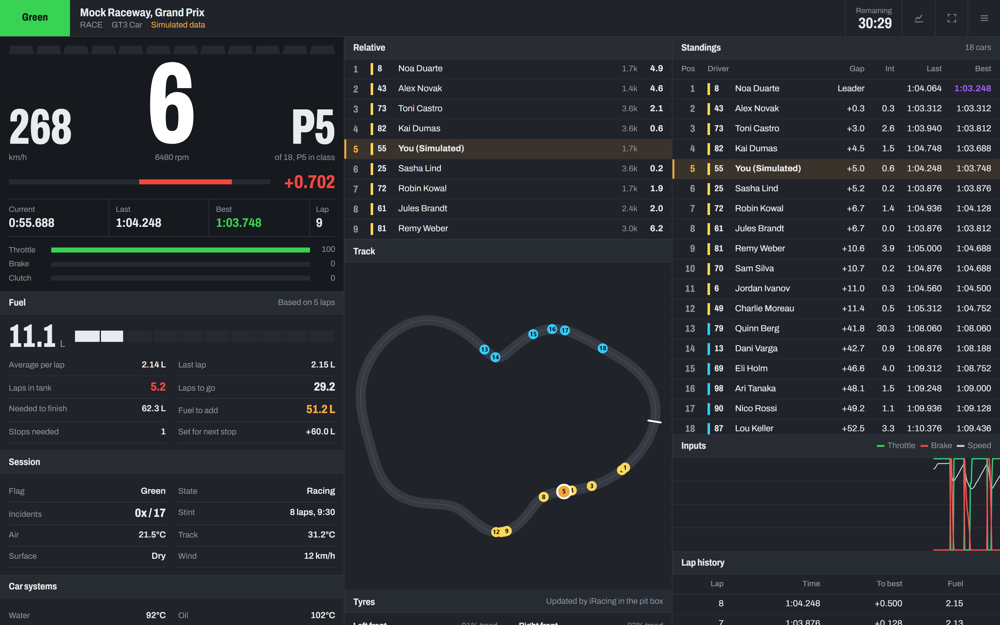
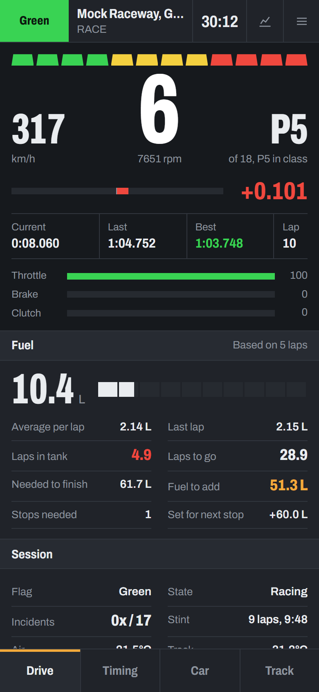
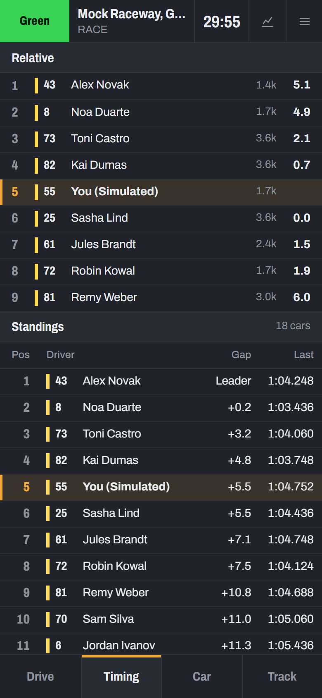
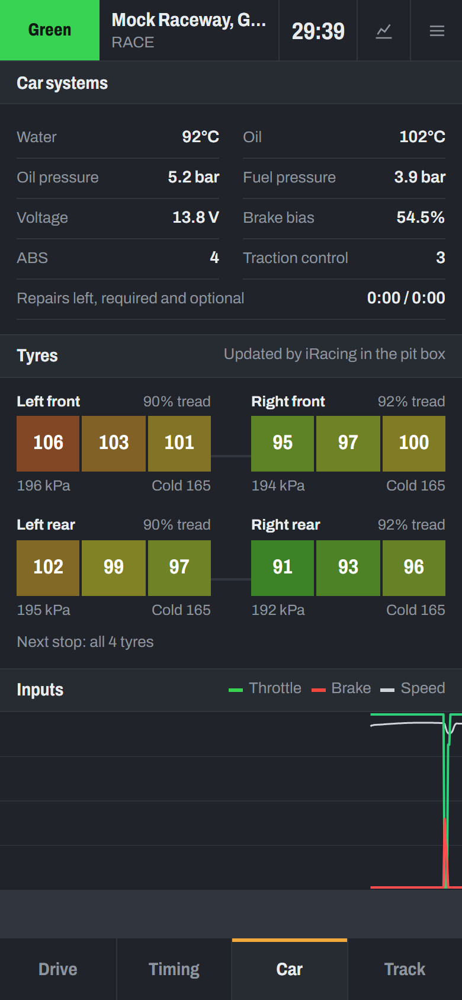
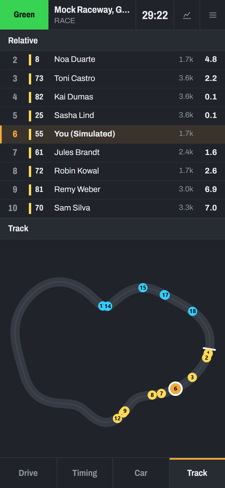
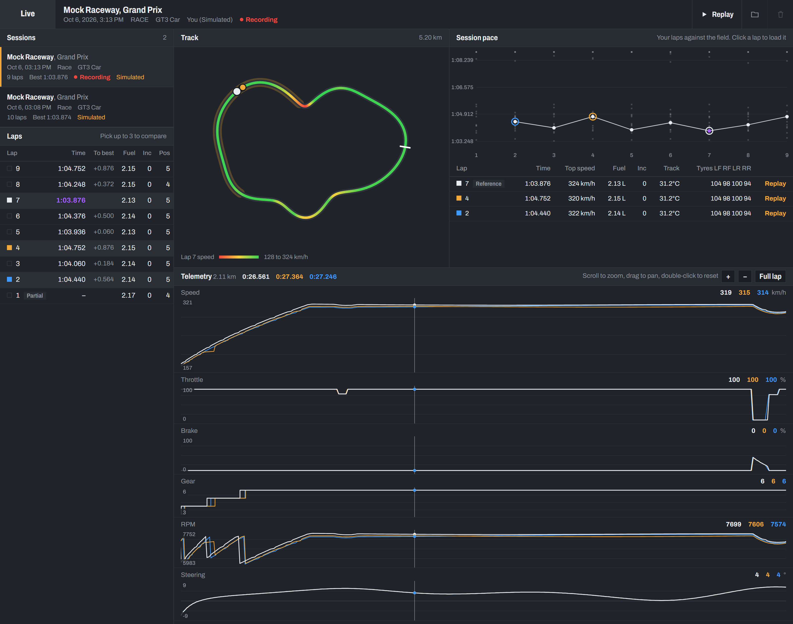
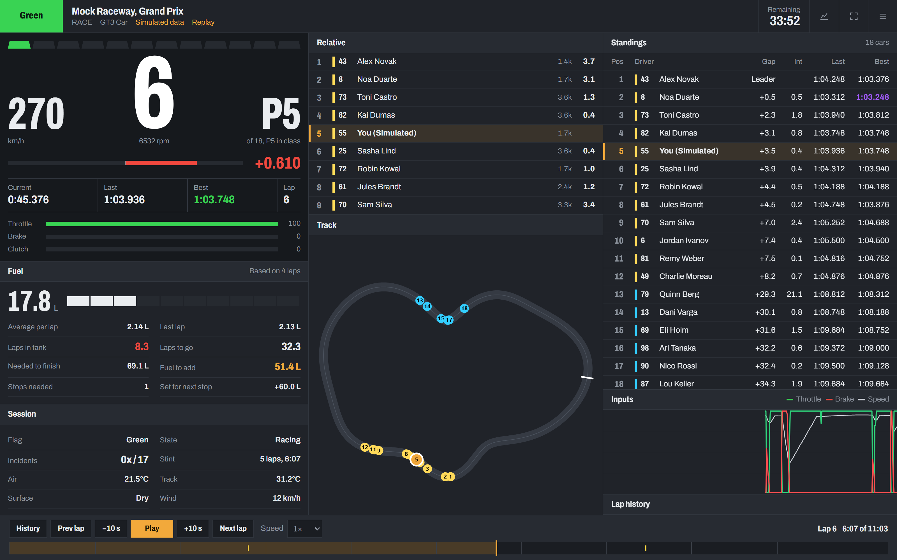

# iRacing Race Engineer Dashboard

A live telemetry dashboard for iRacing that runs in any browser. Start it on the PC running the sim, then open it on
your phone as a second screen, or send the link to whoever is acting as your race engineer. Every session is
recorded, so afterwards you can compare laps and replay the race.



| Drive | Timing | Car | Track |
|---|---|---|---|
|  |  |  |  |

## Features

**Live**
- Gear, speed, shift lights from the car's own shift points, delta bar, lap times, pedal inputs, warnings
- Fuel strategy: use per lap, laps in the tank, laps to go, fuel to finish, fuel to add, stops needed
- Relative and full standings with gaps, intervals and class colours; flags; incidents; stint length; weather
- Tyres, car systems and an input trace
- Track map drawn automatically from your first clean lap, with every car on it

**After the session**
- Every lap's telemetry recorded at 60 Hz, plus pit stops, incidents, flags and the whole field's lap times
- Lap analysis: overlay up to 3 laps on linked charts and a speed-coloured track map
- Replay any session in the live view, with play, pause, seek, lap jumps and up to 16× speed
- Choose where races are saved, including a NAS or other network share





## Quick start

You need Windows (the PC that runs iRacing) and [Python 3.10 or newer](https://www.python.org/downloads/).

```bash
git clone https://github.com/dntAtMe/iracing-dashboard.git
cd iracing-dashboard
run.bat
```

`run.bat` sets everything up the first time, then prints the addresses to open:

```
  iRacing dashboard  (live iRacing)
  This PC:      http://localhost:8765/
  Phone / LAN:  http://192.168.1.23:8765/
  History:      http://localhost:8765/history.html
```

Open the **Phone / LAN** address on a device on the same Wi-Fi, and allow Python through the Windows firewall when
asked. The dashboard connects as soon as you get in the car.

No iRacing to hand? `.venv\Scripts\python server.py --mock` runs a simulated race.

## Documentation

- **[User Guide](docs/USER_GUIDE.md)**
  - [setup](docs/USER_GUIDE.md#1-getting-started)
  - [phones and remote engineers (Tailscale)](docs/USER_GUIDE.md#2-opening-the-dashboard-on-other-devices)
  - [every panel explained](docs/USER_GUIDE.md#3-the-live-dashboard)
  - [lap analysis](docs/USER_GUIDE.md#4-history-and-lap-analysis)
  - [replay](docs/USER_GUIDE.md#5-replay)
  - [the data folder](docs/USER_GUIDE.md#6-where-your-races-are-saved)
  - [options](docs/USER_GUIDE.md#7-settings-and-options)
  - [troubleshooting](docs/USER_GUIDE.md#8-troubleshooting)
- **[Architecture](docs/ARCHITECTURE.md)**: how it works inside, including the message format, the database, the
  algorithms and the API, and how to add a panel.

## How it works

```
iRacing ──60 Hz──► sources.py ──► engine.py ──► server.py ──WebSocket──► browsers (static/)
                                      │
                                      └──► history.py ──► history.db ──► History page and replay
```

A background thread reads iRacing's telemetry 60 times a second. The engine turns it into dashboard data, the server
streams it to every open browser, and the recorder saves it. Plain Python (FastAPI) and plain HTML, CSS and
JavaScript, with no build step.

## Project layout

```
server.py            Web server, live stream, history API, command-line options
engine.py            Telemetry → dashboard data: fuel strategy, laps, relative, standings, track map
history.py           Recording, data folder, history and replay queries
sources.py           iRacing reader (pyirsdk) and the race simulator
static/              Live dashboard (index.html, app.js), History page (history.html, history.js), styles
docs/                User guide, architecture notes, screenshots
```

## License

[MIT](LICENSE). Not affiliated with or endorsed by iRacing.com Motorsport Simulations.
