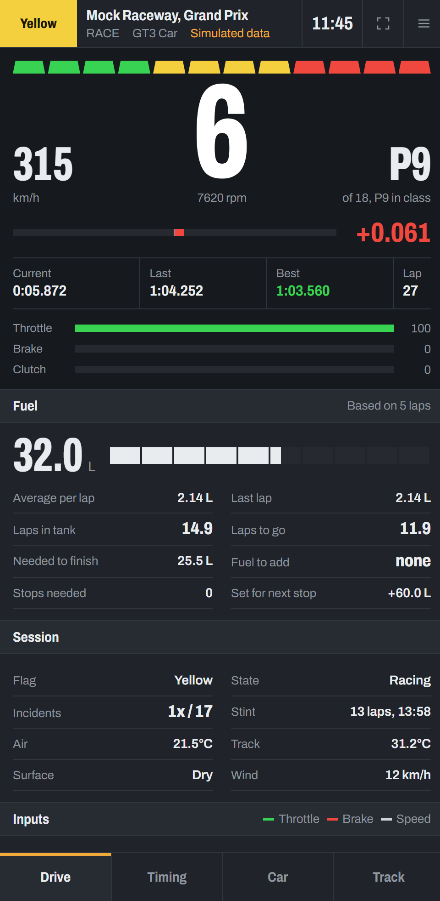

# iRacing Race Engineer Dashboard

A live telemetry dashboard for iRacing that runs in any browser. Start it on the PC running the sim, then open it
on your phone as a second screen or hand the link to the person acting as your race engineer.


<p align="center"></p>

## Features

| Area | What you get |
|---|---|
| **Drive** | Gear, speed, shift lights driven by the car's own RPM settings, delta bar (against your best lap or the session best), current, last and best lap, pedal inputs, pit limiter and engine warnings |
| **Fuel** | Average use per lap from clean laps, laps left in the tank, laps to go (timed or lap-limited races), fuel to finish, fuel to add, stops needed, fuel set for the next stop |
| **Session** | Flag shown in the status bar, time and laps remaining, incidents against the limit, stint length, air and track temperature, track wetness, wind |
| **Timing** | Relative with lapping and lapped cars coloured, full standings with gap, interval, last and best lap (purple = fastest overall), your lap history with fuel used per lap |
| **Car** | Tyre temperatures, tread and pressures laid out like the car, water and oil temperatures, oil and fuel pressure, voltage, brake bias, ABS, traction control, repair time left, input trace |
| **Track** | A track outline drawn automatically from your first clean lap and saved for next time, with every car placed on it |

On a wide screen everything shows at once as a three-column console. On a phone the same panels are split
across Drive, Timing, Car and Track tabs.

## Requirements

- Windows (iRacing's telemetry is only available on the PC running the sim)
- Python 3.10 or newer
- Any modern browser on the viewing device

## Quick start

```bash
git clone https://github.com/dntAtMe/iracing-dashboard.git
cd iracing-dashboard
run.bat
```

`run.bat` creates a virtual environment and installs dependencies the first time, then starts the server. When it
starts, it prints the addresses to open:

```
  iRacing dashboard  (live iRacing)
  This PC:      http://localhost:8080/
  Phone / LAN:  http://192.168.1.23:8080/
```

Open the LAN address on any device connected to the same Wi-Fi. The first time, Windows Firewall asks whether
Python may accept connections. Allow it on **Private** networks.

You can start the server before or after iRacing. It connects as soon as you are in the car and reconnects
automatically between sessions.

### Manual setup

```bash
python -m venv .venv
.venv\Scripts\pip install -r requirements.txt
.venv\Scripts\python server.py
```

### Try it without iRacing

A built-in simulator runs a 40-minute multiclass race (GT3 and GT4) with pit stops, flags and incidents:

```bash
.venv\Scripts\python server.py --mock
.venv\Scripts\python server.py --mock --mock-speed 4   # 4x faster
```

## Using it on a phone

- Add the page to your home screen to open it full screen without the browser bar.
- Turn off auto-lock while you drive. Browsers only let a page keep the screen awake over HTTPS.
- Turn the phone sideways for a two-column layout.
- Unit choices (km/h or mph, °C or °F, litres or gallons, kPa, psi or bar) and the delta reference are under the
  menu button in the top right. Each device remembers its own choices.

## Remote race engineer

If your engineer is not on your network, the simplest option is [Tailscale](https://tailscale.com/). Install it on
both machines, then they open `http://<your-tailscale-ip>:8080`.

If you expose the server any other way (port forwarding, a tunnel), require a token:

```bash
.venv\Scripts\python server.py --token SOME-LONG-SECRET
```

and share `http://<host>:8080/?token=SOME-LONG-SECRET`. Without a token, anyone who can reach the port can see your
telemetry. The dashboard is read-only and can't control the sim.

## Command-line options

| Option | Default | Description |
|---|---|---|
| `--port` | `8080` | HTTP port |
| `--host` | `0.0.0.0` | Address to listen on. Use `127.0.0.1` to allow only this PC |
| `--token` | none | Require `?token=` on every connection |
| `--mock` | off | Use the built-in race simulator instead of iRacing |
| `--mock-speed` | `1.0` | Time multiplier for the simulator |

## Good to know

- **Tyre data** is refreshed by iRacing only while the car is in the pit box, not live on track. This is a
  limitation of iRacing's live telemetry.
- **Fuel estimates** appear after one clean lap. Laps that include a pit visit, and the partial lap in progress when
  the dashboard connects, are not counted.
- **The track map** is drawn from your speed and heading over one lap without pitting or resetting. It is saved in
  `maps/`. Delete the file for a track to redraw its outline.
- **Gaps** in the relative and standings come from iRacing's own estimates, so they can differ slightly from the
  in-sim black boxes.
- Values your car doesn't have (for example a second traction control setting) are shown as `–`.

## Troubleshooting

| Status bar shows | Meaning and fix |
|---|---|
| **Offline** | The browser can't reach the server. Check that `server.py` is running, that you used the LAN address and not `localhost` on the phone, and that the firewall allows Python on private networks. |
| **Standby** | The server is running but iRacing isn't sending data yet. Load into a session and get in the car. |
| A flag colour or **Live** | Receiving telemetry. |

If the page looks out of date after updating, reload it. The server tells browsers to check for a newer version on
every load.

## How it works

```
iRacing shared memory ──► sources.py ──► engine.py ──► server.py ──WebSocket──► browser (static/)
     (60 Hz)              read vars       fuel, laps,     20 Hz driving data
                                          standings,       4 Hz strategy/timing
                                          track map        map on change
```

A background thread polls iRacing at 60 Hz. The engine turns raw telemetry into three kinds of message, and the
server pushes them to every connected browser. Each browser receives only the newest message of each kind, so a
phone on weak Wi-Fi skips stale frames instead of falling behind.

See [docs/ARCHITECTURE.md](docs/ARCHITECTURE.md) for the message format, the fuel and track-map algorithms, and how to
add a panel.

## Project layout

```
server.py           FastAPI app, WebSocket fan-out, telemetry thread, CLI
engine.py           Telemetry → dashboard frames: fuel strategy, lap tracking, relative, standings, TrackMap
sources.py          IRacingSource (pyirsdk) and MockSource (race simulator)
static/index.html   Dashboard markup
static/style.css    Console styling and responsive layout
static/app.js       WebSocket client, rendering, canvas map and input trace
docs/               Architecture notes and screenshots
maps/               Saved track outlines (created at runtime, not committed)
```

## License

[MIT](LICENSE)

This project is not affiliated with or endorsed by iRacing.com Motorsport Simulations.
