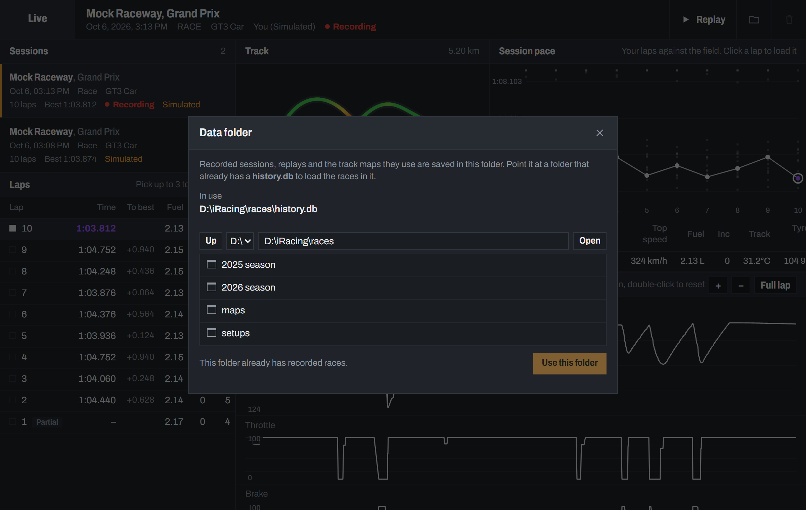

# User Guide

- [1. Getting started](#1-getting-started)
- [2. Opening the dashboard on other devices](#2-opening-the-dashboard-on-other-devices)
- [3. The live dashboard](#3-the-live-dashboard)
- [4. History and lap analysis](#4-history-and-lap-analysis)
- [5. Replay](#5-replay)
- [6. Where your races are saved](#6-where-your-races-are-saved)
- [7. Settings and options](#7-settings-and-options)
- [8. Troubleshooting](#8-troubleshooting)

---

## 1. Getting started

**You need:** Windows (the PC that runs iRacing), [Python 3.10 or newer](https://www.python.org/downloads/), and
a browser on whatever device will show the dashboard.

1. Download the project, either with `git clone https://github.com/dntAtMe/iracing-dashboard.git` or with
   **Code → Download ZIP** on GitHub, and unzip it.
2. Double-click **`run.bat`**. The first time, it sets itself up, which takes a minute.
3. A window opens with the addresses to use:

   ```
     iRacing dashboard  (live iRacing)
     This PC:      http://localhost:8765/
     Phone / LAN:  http://192.168.1.23:8765/
     Tailscale:    http://100.101.102.103:8765/
     History:      http://localhost:8765/history.html
     Ctrl+C to stop
   ```

4. Start iRacing and get in the car. The dashboard connects on its own within a couple of seconds.

Keep the window open while you drive. Closing it, or pressing Ctrl+C, stops the dashboard and finishes the session
being recorded.

You can start the dashboard before or after iRacing, and leave it running between sessions.

### Trying it without iRacing

To look around without the sim, run a simulated 40-minute GT3/GT4 race:

```bash
.venv\Scripts\python server.py --mock
```

Simulated races are saved separately from your real ones and are marked **Simulated** everywhere.

---

## 2. Opening the dashboard on other devices

### Your phone or tablet at home

Open the **Phone / LAN** address on a device connected to the same Wi-Fi.

The first time, Windows asks whether Python may accept connections. Allow it on **Private** networks. If your
Wi-Fi is set to *Public* in Windows, either change it to Private (Settings → Network → your Wi-Fi → Private network)
or use Tailscale as described below.

Tips for using a phone as a second screen:

- Add the page to your home screen (browser menu → *Add to Home screen*) to open it full screen.
- Turn off auto-lock while driving. Web pages can only keep the screen on over HTTPS.
- Turn it sideways to see two panels side by side.

### A race engineer somewhere else

The simplest way is [Tailscale](https://tailscale.com/), a free private network between your own devices.

1. Install Tailscale on the sim PC and on the engineer's device, signed in to the same network (or share the PC with
   them from the Tailscale admin console).
2. Allow the dashboard through the Windows firewall on Tailscale only. Open **PowerShell as Administrator** and run:

   ```powershell
   New-NetFirewallRule -DisplayName "iRacing dashboard (Tailscale)" -Direction Inbound -Protocol TCP -LocalPort 8765 -InterfaceAlias Tailscale -RemoteAddress 100.64.0.0/10 -Action Allow
   ```

3. The engineer opens the **Tailscale** address from the startup window, or `http://<your-pc-name>:8765`.

This also works for your own phone away from home Wi-Fi.

To remove the firewall rule later:
`Remove-NetFirewallRule -DisplayName "iRacing dashboard (Tailscale)"`.

> If you expose the dashboard any other way (port forwarding, a tunnel), start it with a password:
> `.venv\Scripts\python server.py --token SOME-LONG-SECRET` and share `http://<address>:8765/?token=SOME-LONG-SECRET`.
> Anyone who can open the page can see your telemetry. Nobody can control the sim from it.

---

## 3. The live dashboard


On a computer everything is shown at once in three columns. On a phone the same panels are split across four tabs
at the bottom: **Drive**, **Timing**, **Car** and **Track**.

| Drive | Timing | Car | Track |
|---|---|---|---|
|  |  |  |  |

### Top bar

- **Left block** shows the current flag in its colour: Green, Yellow, Blue, White, Black, Meatball, Red, Checkered or
  Debris. It reads **Live** when there's no flag, **Standby** while waiting for iRacing, and **Offline** if the page
  can't reach the dashboard.
- **Track, session and car** names.
- **Remaining**: time left in the session and laps left, when the session has a limit.
- Buttons for **History**, **full screen**, and the **options menu** (units and delta reference).

### Drive panel

- **Shift lights** follow your car's own shift points, from green through yellow to red, and flash blue at the shift
  point.
- **Speed**, **gear** and **position**. In multiclass sessions your class position is shown below the overall one.
  The gear turns amber while the pit limiter is on.
- **Delta bar**: green and to the left when you're ahead of the reference lap, red and to the right when behind. By
  default the reference is your best lap; switch to the session best in the options menu.
- **Current, last and best** lap. Best is green, or purple when it's the fastest in the session.
- **Throttle, brake and clutch** bars.
- **Badges** for the pit limiter, pit lane and engine warnings (water temperature, oil or fuel pressure, oil
  temperature). With the engine off you'll only see *Engine off*.

### Fuel

| Value | Meaning |
|---|---|
| Average per lap | Fuel used per lap, averaged over your last 5 clean laps |
| Last lap | Fuel used on the last clean lap |
| Laps in tank | How far the current fuel lasts. Red when it won't reach the end |
| Laps to go | Laps left in the race, from the lap count or the clock and your average lap time |
| Needed to finish | Fuel for the laps to go |
| Fuel to add | What to put in at the next stop to finish |
| Stops needed | Based on your tank size |
| Set for next stop | The fuel currently selected in the pit menu |

Numbers appear after your first clean lap. Laps that include a pit visit don't count.

### Session

Flag, session state, incidents (against the limit, red as you get close), your current stint (laps and time since
leaving the pits), air and track temperature, track surface (dry to extremely wet) and wind.

### Relative and standings

- **Relative**: the 4 cars ahead of you on track and the 4 behind, with the gap in seconds. Orange names are a lap or
  more ahead of you; blue names are a lap or more behind. Cars in the pits are dimmed.
- **Standings**: everyone, with gap to the leader, interval to the car ahead, last and best lap. Purple is the
  fastest lap in the session. `+1L` means a lap down. The coloured stripe by the car number is the car class.
- **Lap history**: your laps with time, difference to your best, and fuel used.

### Car

- **Tyres**, laid out like the car seen from above: temperatures across each tyre (inside, middle, outside), tread
  left and pressures.

  iRacing only updates tyre data while you're in the pit box, so these numbers don't change on track.
- **Car systems**: water and oil temperature, oil and fuel pressure, voltage, brake bias, ABS, traction control and
  repair time left. Values your car doesn't have show as `–`.
- **Inputs**: the last 20 seconds of throttle, brake and speed.

### Track

The track outline is drawn automatically from your first clean lap at each track (no pit visits, resets or tows),
then saved for next time. Until then, cars are shown on a circle. Your car is amber with a white ring; the others
are in their class colour with their position.

---

## 4. History and lap analysis

Open it with the chart button in the top bar of the live dashboard, or go to `/history.html`.

Every session is saved automatically while the dashboard runs: every lap's telemetry, lap times, fuel, incidents,
positions, pit stops and flags, and the whole field's lap times.


### Choosing laps

1. Pick a **session** on the left. The one being recorded right now is marked **Recording** and updates by itself.
2. Click **laps** to compare, up to three. The first one you pick is the **reference** (white); the others are amber
   and blue. Your best lap is picked automatically when a session opens. Click a lap again to remove it.

   Laps marked **Partial** were joined part-way (after connecting, a reset or a tow). **Pit** laps include a pit visit.

### Reading the charts

Speed, throttle, brake, gear, RPM, steering, lateral and longitudinal G, and **delta to reference** (how much time
each lap has gained or lost against the reference by that point of the lap), all against distance around the lap.

- **Hover** any chart: a cursor moves on every chart at once, and each lap's value is shown at the top right of
  each chart. The distance and each lap's time at that point appear next to *Telemetry*.
- **Scroll** to zoom in around the mouse, **drag** to pan, **double-click** to see the whole lap again. The **+**,
  **−** and **Full lap** buttons do the same on touch screens.

### Track map

- The outline is coloured by the reference lap's speed: red is slow, green is fast.
- While you hover the charts, the white marker shows the reference lap at the cursor. The other laps' markers show
  where those laps were **at the same moment**, so you can see the gap on track.
- Hover the map to move the chart cursor to that part of the track. Click to zoom the charts in there.
- The zoomed part of the lap is highlighted in amber.
- Red crosses mark incidents on the selected laps, blue squares mark pit entry and exit, and yellow squares mark
  yellow flags.

### Session pace

Your lap times as a line, with every other driver's laps as grey dots. Purple is your best lap and hollow points are
pit laps. Hover a point for details; click one of your laps to add it to the comparison.

Below it, a table compares the selected laps: time, top speed, fuel, incidents, track temperature and average tyre
temperatures.

### Deleting a session

Use the bin button in the top bar. A session that's still recording can't be deleted.

---

## 5. Replay

Replay plays a recorded session back in the live dashboard, so you see exactly what you, or your engineer, saw at the
time: relative, standings, fuel, map, inputs and all.


Start it from **History**:

- **Replay** in the top bar plays the whole session from the start.
- **Replay** next to a lap in the comparison table starts at that lap.

Controls along the bottom:

| Control | Does |
|---|---|
| **Play / Pause** | Space bar |
| **−10 s / +10 s** | Left and Right arrows skip 5 s; with Shift, 30 s |
| **Prev lap / Next lap** | Jump to the start of a lap |
| **Speed** | 0.5× to 16× |
| **Timeline** | Click or drag to jump anywhere. Thin marks are lap starts, red incidents, blue pit stops, yellow flags |
| **History** | Back to the analysis page |

Sessions recorded before replay was added can be analysed but not replayed.

---

## 6. Where your races are saved

Everything for your races lives in one **data folder**:

- `history.db` holds the sessions, laps and replay data.
- `maps/` holds the track outlines those sessions use.

Because the folder is self-contained, you can back it up, move it, or open it from another PC.

By default it's the dashboard's own folder. To change it:

1. On the **sim PC**, open **History** and click the folder button in the top bar.
2. Browse to a folder. The drop-down lists your drives and, below the line, the network shares Windows remembers
   for you. You can also type a path, including a network one such as `\\nas\races`. Typing just a server name such
   as `\\192.168.1.50` lists its shares.
3. Click **Use this folder**.



- Pick a folder that already has a `history.db` and its races appear straight away. *This folder already has
  recorded races* tells you when that's the case.
- New sessions are saved there from then on. A session in progress ends in the old folder and carries on as a new
  session in the new one.
- The choice is remembered for next time.
- For safety, the folder can only be changed on the PC running the dashboard. Other devices can see which folder is
  in use but can't browse your disks.

**Network folders** (a NAS or shared drive) work. Keep to one dashboard writing to the same folder at a time. If the
share isn't reachable after a reboot, open it once in File Explorer so Windows reconnects it.

**Disk space:** about 50 KB per lap of telemetry, plus roughly 5–15 MB per hour for replay, depending on how many
cars are in the session.

---

## 7. Settings and options

### In the browser

The options menu (top right of the live dashboard) sets speed (km/h or mph), temperature (°C or °F), fuel (litres
or gallons), tyre pressure (kPa, psi or bar), and what the delta bar compares against (your best lap or the session
best). Each device remembers its own choices; History uses the same ones.

### When starting the server

Add these after `server.py`, or after `run.bat`:

| Option | Default | |
|---|---|---|
| `--port 8765` | 8765 | Change the port if another program uses it. The window tells you if so |
| `--host 127.0.0.1` | all networks | Only allow this PC |
| `--token SECRET` | none | Require `?token=SECRET` in every address |
| `--data-dir PATH` | as chosen in History | Data folder for this run, overriding the one chosen in History |
| `--no-history` | off | Don't record anything |
| `--mock` | off | Simulated race instead of iRacing |
| `--mock-speed 4` | 1 | Run the simulation faster |

---

## 8. Troubleshooting

| What you see | What to do |
|---|---|
| The window says the **port is already in use** | Another program uses 8765. Start with `run.bat --port 8766`, or the number it suggests |
| **Offline** in the top bar | The page can't reach the dashboard. Check the window is still open. On a phone, use the LAN or Tailscale address, not `localhost` |
| The phone can't open the page at all | Allow Python through the Windows firewall, check the phone is on the same Wi-Fi, or use Tailscale (section 2) |
| **Standby** in the top bar | The dashboard is running but iRacing isn't sending data. Load into a session and get in the car |
| Fuel numbers show `–` | Complete one clean lap without pitting |
| No track outline | Drive one full lap without pitting, resetting or being towed |
| Tyre numbers never change | Normal: iRacing only updates them in the pit box |
| A session is missing in History | Sessions where you didn't drive part of a lap aren't kept. Check the data folder (section 6) |
| **Replay** button missing | That session was recorded before replay existed |
| Can't change the data folder | It can only be changed on the PC running the dashboard, at `http://localhost:8765/history.html` |
| The page looks out of date after an update | Reload it |
